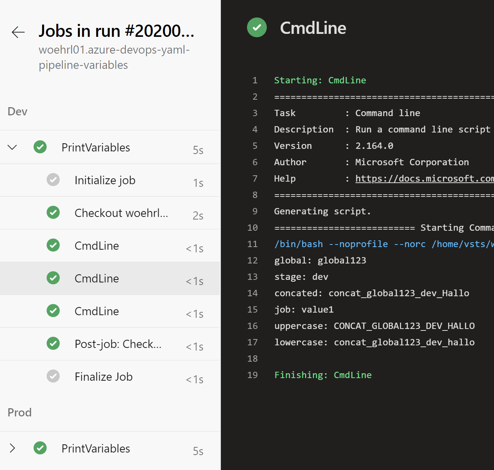

Demonstrated to usage of templates for sharing variables

Uses the following Git repositories:

* https://github.com/woehrl01/azure-devops-yaml-pipeline-variables
* https://github.com/woehrl01/azure-devops-yaml-pipeline-variables-shared

# Preview

